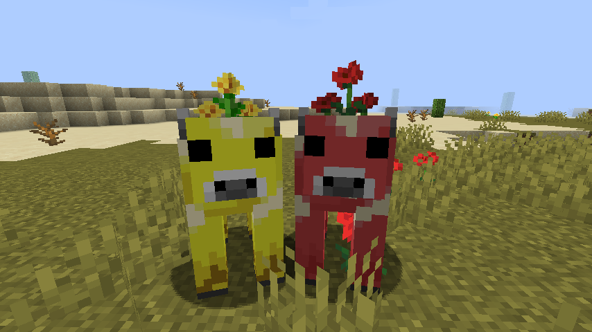

## Mooshbloom Mod

### Description
This mod introduces a new entity in Minecraft Java, inspired by the Moobloom mod from Minecraft Earth.
The Mooshbloom entity has several features:
- Found in the rare Flower Forest biome.
- Found in twelve different flower types!
- Mooshblooms place flowers!
- Harvest honey with glass jars!
- Mooshblooms are attracted to bee nests..
- .. and bees will aggressively defend Mooshblooms!

### Preview

The dandelion and poppy Mooshblooms say hello!

### Credits
Thanks to for Slexom for the inital Moobloom port in their Earth2Java mod.